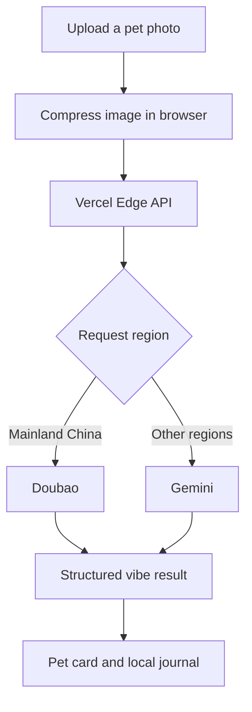

<p align="center">
  
</p>

<h1 align="center">Pawerful</h1>

<p align="center">
  An AI-powered pet vibe scanner and memory journal for cats, dogs, and the humans who adore them.
</p>

<p align="center">
  <a href="./LICENSE"></a>
  
  
</p>

> **Project status:** early-stage and experimental. Pawerful's AI output is playful interpretation, not veterinary, medical, training, breed-identification, or safety advice.

## What it does

Upload a photo of a cat or dog and Pawerful turns the image into a playful, structured "vibe check": a breed guess, current mode, three personality stats, safety indicators, and a short first-person diary line.

The scanner is paired with a small pet-keeping experience:

- AI photo analysis for cats and dogs
- Pet profiles and repeat scans
- Downloadable pet identity cards
- A journey timeline for milestones, health notes, moods, and funny moments
- Local-first storage for profiles and memories
- A mobile-first interface with warm, playful visual design
- Geo-aware AI routing: Gemini outside mainland China and Doubao in mainland China

Pawerful began as a Gemini hackathon experiment by a landscape architect and product-minded AI builder. It is now being developed in the open as an accessible, design-led AI project.

## How it works



The browser sends the selected image to `/api/analyze-pet`. The server-side route chooses an AI provider by request region and asks for a small JSON response. Pet profiles, scan history, and journey entries are stored in the browser's `localStorage`.

## Tech stack

- React 18
- Vite 5
- Tailwind CSS 3
- Framer Motion
- Phosphor Icons
- Vercel Edge Functions
- Google Gemini and Volcengine Doubao multimodal APIs

## Run locally

### Prerequisites

- Node.js 18 or newer
- npm
- A Gemini API key and/or Volcengine API key

### Setup

```bash
git clone https://github.com/njlandarch-sudo/Pawerful.git
cd Pawerful
npm install
cp .env.example .env.local
```

Add your server-side keys to `.env.local`:

```dotenv
GEMINI_API_KEY=your_gemini_key
VOLCENGINE_API_KEY=your_volcengine_key
```

For the complete app, including the serverless API route:

```bash
npx vercel dev
```

For UI-only development:

```bash
npm run dev
```

`npm run dev` starts Vite but does not emulate the `/api/analyze-pet` serverless function. The current API defaults to Doubao when geo data is unavailable, so local scanning through `vercel dev` requires `VOLCENGINE_API_KEY` unless the routing logic is changed.

Before opening a pull request, verify the production build:

```bash
npm run build
```

## Environment variables

| Variable | Used by | Required when |
| --- | --- | --- |
| `GEMINI_API_KEY` | Gemini API | Serving users outside mainland China |
| `VOLCENGINE_API_KEY` | Doubao API | Serving users in mainland China or using the current local fallback |

These values must stay server-side. Never use a `VITE_` prefix for provider secrets, and never commit `.env` files.

## Privacy and responsible use

- Uploaded images are sent to the selected AI provider for analysis.
- Pet profiles, journey entries, and scan history are stored in the current browser through `localStorage`.
- Clearing site data or changing browsers can remove locally stored records.
- AI-generated breed, mood, and safety fields can be wrong. Do not use them to make health, handling, or safety decisions.
- Public deployments should add rate limiting and abuse protection before inviting significant traffic.

## Contributing

Ideas, bug reports, design feedback, and code contributions are welcome. First-time and AI-assisted contributors are welcome too; contributors remain responsible for understanding and testing the changes they submit.

Read [CONTRIBUTING.md](./CONTRIBUTING.md), then browse the [open issues](https://github.com/njlandarch-sudo/Pawerful/issues).

## Roadmap

- A demo mode that works without paid API keys
- Rate limiting and safer production error handling
- Automated tests for the API response contract
- Gradual component extraction from `src/App.jsx`
- Accessibility and responsive-layout improvements
- Optional export/import for locally stored pet memories
- Internationalization

The roadmap is intentionally small and practical. Proposed changes should preserve Pawerful's warm visual identity and low-friction experience.

## License

Pawerful is available under the [MIT License](./LICENSE).

